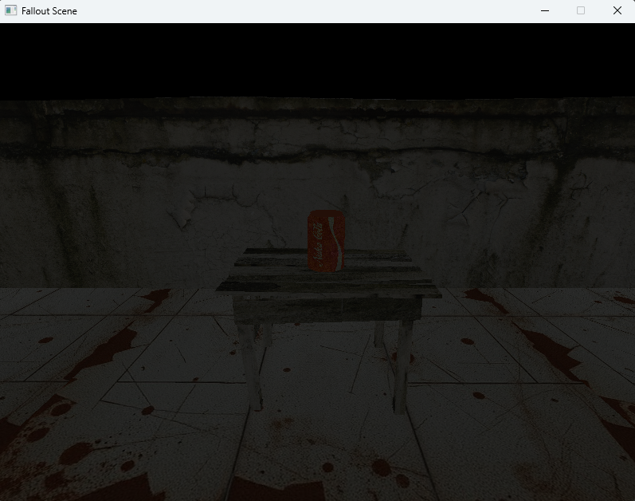
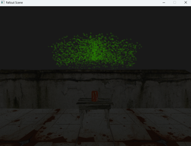
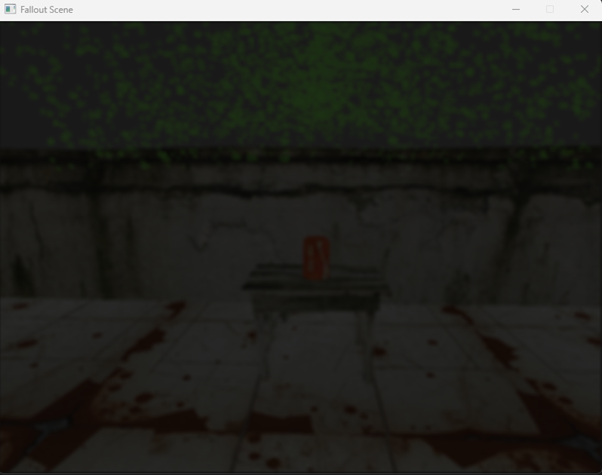

# Optimised-Developer-Tool
A project that showcases 3 shading techniques combined into one efficient render pipeline

## Video:

## How to interact with the exe:
Use W,A,S,D to move around the scene

Use the mouse to look around the scene

### How to run the exe:
Unpack the OpenGLzip and place under C:\Users\Public\OpenGL, then the project should run with no problems. 
If problems do appear, please visit online resources on how to setup include directories  

## What did i start with?
This project is a continuation of my first shader program that can be found [here](https://github.com/Mdot5596/NukaCola-OpenGL-Scene). 

To start with i removed the previous shader featrues such as fog and spotlight, i then implemented new models such as a table for the can to be placed on and a ruined wall.
<div align="center">
  
</div>
After this was done i had a scene that i was ready to start implementing new shader features onto.

## First Shader - Particle fountian 
The idea for particle fountain is that I wanted a radioactive green fizz erupting from the can. I successfully implemented this, I started by creating separate frag and vert shader files specifically for the particle implementation as this would help keep the project organised. 

In vertex shader it performs two main tasks based on the Pass uniform:

Update Pass (Pass == 1):
It simulates particle physics by updating each particle’s position, velocity, and age using time and acceleration inputs. When a particle exceeds its lifetime or is newly spawned, it is reset to the emitter position with a randomised initial velocity.
```cpp
void update()
{
    if (VertexAge < 0 || VertexAge > ParticleLifetime)
    {
        Position = Emitter;
        Velocity = randomInitialVelocity();
        if (VertexAge < 0)
            Age = VertexAge + DeltaT;
        else
            Age = (VertexAge - ParticleLifetime) + DeltaT;
    }
    else
    {
        Position = VertexPosition + VertexVelocity * DeltaT;
        Velocity = VertexVelocity + Accel * DeltaT;
        Age = VertexAge + DeltaT;
    }
}

```
Render Pass (Pass != 1):
It renders the particle as a small quad made up of two triangles. Each vertex is offset to form a square around the particle’s position. Transparency (alpha) fades over the particle’s lifetime, and texture coordinates are passed for sampling in the fragment shader
```cpp
void render()
{
    if (VertexAge <= 0.0) {
        gl_Position = vec4(0.0);
        return;
    }

    vec4 worldPos = vec4(VertexPosition, 1.0);
    vec4 offsetWorld = vec4(offsets[gl_VertexID] * ParticleSize, 0.0);

    vec4 finalPos = worldPos + offsetWorld;
    gl_Position = ProjectionMatrix * ModelViewMatrix * finalPos;

    TexCoord = texCoords[gl_VertexID];
    Transp = clamp(1.0 - VertexAge / ParticleLifetime, 0.0, 1.0);
}

```
<div align="center">
  
</div>


## Second Shader - Gaussian Blur
The idea behind using Gaussian Blur was inspired by the aesthetic of the fallout series. If you’re a fan you know the setting involves widespread nuclear devastation, with atomic bombs dropping everywhere. I wanted the blur effect to represent the impact of radiation on the user – specifically what it would be like to see after the radiation has affected your eyesight.

I created two new shaders for this called Blur.vert and Blur.frag, these shaders 


As you can tell from the previous images, a blur effect has now been applied to the scene. 
<div align="center">
  
</div>


# Resources Used
### OpenGL handbook
- https://learnopengl.com/Advanced-OpenGL/Cubemaps

### Libaries
- **GLAD** [Link](https://glad.dav1d.de/#language=c&specification=gl&api=gl%3D4.6&api=gles1%3Dnone&api=gles2%3Dnone&api=glsc2%3Dnone&profile=core&loader=on)
- **Glm** [Link](https://github.com/g-truc/glm)
- **GLFW 3** [Link](https://www.glfw.org/)

### Developer Environment
This project was created using Visual studio and Github Desktop Application

### Labs
- **My Repository:** [Link](https://github.com/Mdot5596/3105-Labs)

### Models
- **Website links:**
  - [NukaCola Can](https://www.turbosquid.com/3d-models/nuka-cola-can-1338119)
  - [Skybox Gen](https://tools.wwwtyro.net/space-3d/index.html#animationSpeed=1&fov=80&nebulae=true&pointStars=true&resolution=256&seed=2stncnkuzc20&stars=true&sun=true)
  - [Particle image](https://www.citypng.com/png-download/35789)
  - [Table model](https://www.turbosquid.com/3d-models/old-table-3ds/936055)
  - [Wall model](https://www.turbosquid.com/3d-models/free-damaged-wall-3d-model/747378)


